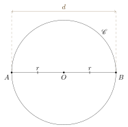

#+STARTUP: showall

#+TITLE: Eclats de vers : Matemat : Géométrie plane
#+AUTHOR: chimay
#+EMAIL: or du val chez gé courriel commercial
#+LANGUAGE: fr
#+LINK_HOME: file:../index.html
#+LINK_UP: file:index.html
#+HTML_HEAD: <link rel="stylesheet" type="text/css" href="../style/defaut.css" />

#+OPTIONS: H:6
#+OPTIONS: toc:nil

#+TAGS: noexport(n)

[[file:index.org][Index mathématique]]

#+INCLUDE: "../include/navigan-1.org"

#+TOC: headlines 1

#+INCLUDE: "../include/latex/latex.org"

* Point

Le point est l’élément le plus fondamental en géométrie. Les autres
objets sont définis, soit comme un ensemble de points, soit comme une
fonction agissant sur des points.

On note par convention un point par une lettre majuscule.

* Plan

Un plan $\Pi$ est une surface plane composée d’un ensemble de
points qui s’étend à l’infini.

* Droite

#+TOC: headlines 1 local

** Définition

Une droite $d$ est un ensemble de points alignés sur une ligne droite
infinie. On note une droite par une lettre minuscule.

Le schéma ci-dessous représente une droite $d$ :

#+attr_html: :width 30%
#+attr_latex: :width 0.7\linewidth

Une droite est complètement déterminée par deux de ses points.  Si on
connaît deux points $A$ et $B$ appartenant à une droite $d$, on peut
donc s’en servir pour désigner $d$. Dans le schéma ci-dessous :

#+attr_html: :width 40%
#+attr_latex: :width 0.7\linewidth

la droite $d$ peut aussi se noter :

$$ (AB) $$

On a donc :

$$ d = (AB) $$

** Sécantes

On dit que deux droites $a$ et $b$ sont sécantes si elles se
croisent en un point $P$ :

$$ a \cap b = \{ P \} $$

Le point $P$ est alors appelé point d’intersection de $a$ et $b$.

Le schéma ci-dessous représenté un exemple de deux droites sécantes
$a$ et $b$ qui s’interctent au point $P$ :

#+attr_html: :width 45%
#+attr_latex: :width 0.7\linewidth

** Points alignés

On dit d’une série de points qu’ils sont alignés si ils appartiennent
à une meme droite. Le schéma ci-dessous représente des points $A$,
$B$ et $C$ alignés :

#+attr_html: :width 30%
#+attr_latex: :width 0.7\linewidth

** Autres notations

On ne note pas toujours les parenthèses :

$$ AB = (AB) $$

* Demi-droite

#+TOC: headlines 1 local

** Définition

Si on coupe une droite $(AB)$ en deux au niveau du point $A$, et
que l’on conserve la partie contenant le point $B$, on obtient la
demi-droite $[AB)$.

Le schéma ci-dessous donne un exemple de demi-droite $[AB)$ :

#+attr_html: :width 35%
#+attr_latex: :width 0.7\linewidth

** Origine

Le point $A$ est appelé origine de la demi-droite $[AB)$.

** Ouverte ou fermée

Il existe plusieurs variantes de demi-droite :

- un demi-droite est dite fermée si elle contient son origine $A$
  + on la note $[AB)$
- un demi-droite est dite ouverte si elle ne contient pas son origine $A$
  + on la note $]AB)$

** Droite prolongeant une demi-droite

On dit qu’une droite $d$ prolonge la demi-droite $[AB)$ si les points $A$
et $B$ appartiennent à $d$, autrement dit si :

$$ d = (AB) $$

** Autres notations

On ne note pas toujours la parenthèse :

$$ [AB = [AB) $$

On peut aussi noter une demi-droite par une lettre minuscule :

$$ f = [AB) $$

* Segment

#+TOC: headlines 1 local

** Définition

Si on coupe une droite $(AB)$ au niveau des points $A$ et $B, et que
l’on conserve la partie située entre $A$ et $B$, on obtient un
segment $[A,B]$.

Le schéma ci-dessous donne un exemple de segment :

#+attr_html: :width 25%
#+attr_latex: :width 0.7\linewidth

Il existe plusieurs variantes de segments :

- le segment $[A,B]$ contient les deux extrémités $A$ et $B$
- le segment $]A,B[$ ne contient ni $A$ ni $B$
- le segment $[A,B[$ contient $A$ mais pas $B$
- le segment $]A,B]$ contient $B$ mais pas $A$

** Extrémités

Les extrémités d’un segment $[A,B]$ sont simplement les points $A$
et $B$ qui délimitent ce segment.

Il est clair que les extrémités d’un segment suffisent à le définir.

** Droite prolongeant un segment

On dit qu’une droite $d$ prolonge un segment $[A,B]$ si les points $A$
et $B$ appartiennent à $d$, autrement dit si :

$$ d = (AB) $$

** Autres notations

On ne note pas toujours la virgule :

$$ [AB] = [A,B] $$

Une lettre minuscule peut aussi servir à désigner un segment :

$$ s = [A,B] $$

** Mesure et construction

On utilise une règle graduée pour :

- mesurer la longueur d’un segment
- tracer un segment de longueur donnée

* Distance
:properties:
:custom_id: heading:distance
:end:

#+TOC: headlines 1 local

** Introduction

La distance entre deux points $A$ et $B$ se note :

$$ \abs{AB} $$

ou :

$$ \overline{AB} $$

ou encore :

$$ \distance(A,B) $$

Cette distance est la longueur du plus court chemin qui mène de $A$
à $B$, c’est-à-dire la longueur du segment $[A,B]$ qui les sépare :

$$ \abs{AB} = \Bigl|[A,B]\Bigr| $$

** Propriétés générales
:properties:
:custom_id: heading:distance_proprietes
:end:

Il est clair qu’une distance entre deux points est positive :

$$ \abs{AB} \ge 0 $$

Elle est également symétrique puisqu'on obtient la même distance
lorsqu'on intervertit les points :

$$ \abs{AB} = \abs{BA} $$

Par ailleurs, la distance entre deux points identiques doit évidemment
être nulle :

$$\abs{AA} = 0$$

Le seul point $Y$ qui peut se trouver à distance nulle de $X$ est le
point $X$ lui-même :

$$\abs{XY} = 0 \quad \Longrightarrow \quad X = Y$$

*** Corollaire

Si $A$ et $B$ sont deux points distincts, leur distance ne peut être
nulle et :

$$\abs{AB} > 0$$

** Inégalité triangulaire
:properties:
:custom_id: heading:distance_inegalite_triangulaire
:end:

Il est toujours plus court d'aller directement du point $A$ au point
$B$ plutôt que de passer par un point intermédiaire $C$. On a donc
l'inégalité triangulaire :

$$ \abs{AB} \le \abs{AC} + \abs{CB} $$

Dans le cas où les trois points $A$, $C$ et $B$ sont alignés et dans
l’ordre présenté ci-dessous :

#+attr_html: :width 30%
#+attr_latex: :width 0.7\linewidth

on a clairement :

$$ \abs{AB} = \abs{AC} + \abs{CB} $$

L’inégalité triangulaire devient alors une égalité.

Par contre, si les trois points ne sont pas alignés :

#+attr_html: :width 30%
#+attr_latex: :width 0.7\linewidth
[[file:tikz/distance-inegalite-triangulaire.svg]]

l’inégalité triangulaire est clairement stricte :

$$ \abs{AB} < \abs{AC} + \abs{CB} $$

** Isométrie

On dit que deux segments sont isométriques lorsqu’ils ont la même
longueur.

* Parallèles

#+TOC: headlines 1 local

** Droites

On dit que deux droites $a$ et $b$ sont parallèles si elles ne se
croisent pas :

$$ a \cap b = \emptyset $$

ou si elles sont confondues :

$$ a = b $$

Si deux droites $a$ et $b$ sont parallèles, on le note :

$$ a \parallel b $$

Le schéma ci-dessous représenté un exemple de deux droites parallèles
$a$ et $b$ :

#+attr_html: :width 45%
#+attr_latex: :width 0.7\linewidth

** Segments

On dit que deux segments $[A,B]$ et $[C,D]$ sont parallèles lorsque
les droites qui les prolongent sont parallèles :

$$ [A,B] \parallel [C,D] \qquad \Longleftrightarrow \qquad (AB) \parallel (CD) $$

** Droite et segment

On dit qu’une droite $d$ est parallèle à un segment $[A,B]$ lorsque
la droite qui prolonge $[A,B]$ est parallèle à $d$ :

$$ d \parallel [A,B] \qquad \Longleftrightarrow \qquad d \parallel (AB) $$

* Circuit

#+TOC: headlines 1 local

** Introduction

Certaines figures géométriques forment un circuit. Ce circuit est
généralement composé de segments et de courbes.

** Polygone

Un polygone est une figure géométrique délimitée par des segments
reliant des points pour former un circuit fermé. Chaque point du circuit
est appelé *sommet* du polygone, tandis que chaque segment est appelé
*côté* du polygone.

** Périmètre

Le périmètre d’une figure géométrique formant un circuit est la
longueur parcourue le long de ce circuit.

* Cercle

#+TOC: headlines 1 local

** Définition

Un cercle $\mathscr{C}$ de centre $O$ et de rayon $r$ est l’ensemble
des points situés à une distance $r$ du point $O$ :

#+attr_html: :width 30%
#+attr_latex: :width 0.7\linewidth

On le note aussi :

$$ \mathscr{C}(O, r) $$

le cercle $\mathscr{C}$ de centre $O$ et de rayon $r$. On a donc :

$$ r = \abs{OP} $$

pour tout $P \in \mathscr{C}(O, r)$. Si $\Pi$ est le plan dans lequel
le cercle $\mathscr{C}$ est tracé, on a :

$$ \mathscr{C}(O, r) = \{ P \in \Pi : \abs{OP} = r \} $$

*Remarque* : ne pas confondre la lettre $O$, qui désigne un point,
avec le neutre pour l’addition $0$.

** Rayon

Le rayon d’un cercle $\mathscr{C}$ de centre $O$ est à la fois :

- la distance entre le centre $O$ et n’importe quel point $P \in \mathscr{C}$
- le segment $[O,P]$ qui relie le centre $O$ à n’importe quel point $P \in \mathscr{C}$

** Corde

Une corde du cercle $\mathscr{C}$ est un segment qui relie deux points
de $\mathscr{C}$.

Le schéma ci-dessous représenté une corde $[A,B]$ du cercle $\mathscr{C}$ :

#+attr_html: :width 30%
#+attr_latex: :width 0.7\linewidth

** Tangente

Une droite $t$ est dite tangente au cercle $\mathscr{C}$ au point $A$ si
$t$ intersecte $\mathscr{C}$ seulement en $A$ :

$$ t \cap \mathscr{C} = \{ A \} $$

Le point $A$ appartient donc à la fois à la droite $t$ et au cercle
$\mathscr{C}$.

On dit aussi que le cercle $\mathscr{C}$ est tangent à la droite $t$.

Le schéma ci-dessous représenté une droite $t = (AB)$, tangente au
cercle $\mathscr{C}$ au point $A$ :

#+attr_html: :width 45%
#+attr_latex: :width 0.7\linewidth

*** Demi-droite

On dit qu’une demi-droite $[AB)$ est tangente à un cercle $\mathscr{C}$
si la droite $(AB)$ qui la prolonge est tangente à $\mathscr{C}$.

*** Segment

On dit qu’un segment $[A,B]$ est tangent à un cercle $\mathscr{C}$
si la droite $(AB)$ qui le prolonge est tangente à $\mathscr{C}$.

** Diamètre

Soit un cercle $\mathscr{C}$ de centre $O$ et de rayon $r$. Un diamètre
de $\mathscr{C}$ est une corde qui passe par le centre $O$.

Le schéma ci-dessous représenté un cercle $\mathscr{C}$ de centre $O$
et de rayon $r$ et un diamètre $[A,B]$ :

#+attr_html: :width 40%
#+attr_latex: :width 0.7\linewidth

Les points $A$ et $B$ appartiennent donc au cercle $\mathscr{C}$ et sont
alignés avec $O$.

Le terme de diamètre désigne aussi la distance entre les extrémités
du segment-diamètre. Dans l’exemple du schéma, on a le diamètre $d$ :

$$ d = \abs{AB} $$

Comme le segment $[A,B]$ englobe deux fois le rayon $r$, on a :

$$ d = 2 \ r $$

Cette distance est donc la même pour tous les segments-diamètres d’un
cercle donné, et vaut le double du rayon du cercle.

** Nombre $\pi$

Il va de soi que tous les cercles de rayon $1$ ont le même périmètre
$\mathcal{P}_1$. Le nombre $\pi$ est défini comme valant la moitié de
ce périmètre :

$$ \pi = \frac{\mathcal{P}_1}{2} $$

Le périmètre d’un cercle de rayon $1$ vaut donc :

$$ \mathcal{P}_1 = 2 \ \pi $$

** Arc de cercle

Un arc de cercle $\Gamma$ est une partie d’un cercle $\mathscr{C}$
comprise entre deux points. Un arc de cercle possède les mêmes
paramètres que le cercle dont il est issu : si $\mathscr{C}$ est de
centre $O$ et de rayon $r$, on dit également que $\Gamma$ est de centre
$O$ et de rayon $r$.

Le schéma ci-dessous représente un arc de cercle $\Gamma$
(en trait plein) de centre $O$ et compris entre les points $A$ et $B$ :

#+attr_html: :width 35%
#+attr_latex: :width 0.7\linewidth

Le reste du cercle dont $\mathscr{C}$ est issu est représenté en
tirets.

On désigne également un arc de cercle par un arc tracé au-dessus
des points extrêmes qui le délimitent. Suivant le schéma ci-dessus,
on a par exemple :

$$ \Gamma = \arcdecercle{AB} $$

*** Longueur

La longeur d’un arc de cercle :

$$ \Gamma = \arcdecercle{AB} $$

peut être notée :

$$ \abs{\Gamma} = \abs{\arcdecercle{AB}} $$

*** Fraction d’un cercle unitaire

Considérons un arc issu d’un cercle de rayon $1$ et engloblant
une fraction $f$ du cercle. Sa longueur vaudra :

$$ 2 \ \pi \ f $$

Le tableau ci-dessous recense quelques cas courants :

| Partie du cercle | $f$   | Longueur      |
|------------------+-------+---------------|
| complet          | $1$   | $2 \ \pi$     |
| moitié           | $1/2$ | $\pi$         |
| tiers            | $1/3$ | $2 \ \pi / 3$ |
| quart            | $1/4$ | $\pi / 2$     |
| sixième          | $1/6$ | $\pi / 3$     |

* Disque

#+TOC: headlines 1 local

** Définition

Un disque $\mathscr{D}$ de centre $O$ et de rayon $r$ est l’ensemble
des points situé sur ou à l’intérieur du cercle $\mathscr{C}(O,r)$ :

#+attr_html: :width 30%
#+attr_latex: :width 0.7\linewidth

On le note aussi :

$$ \mathscr{D}(O, r) $$

Si $\Pi$ est le plan dans lequel le disque $\mathscr{D}$ est tracé, on a :

$$ \mathscr{D}(O, r) = \{ P \in \Pi : \abs{OP} \le r \} $$

** Secteur angulaire

Un secteur angulaire est un ensemble de point compris entre :

- un arc de cercle $\Gamma$
- les rayons $[O,A]$ et $[O,B]$ correspondant aux extrémités
  $A$ et $B$ de $\Gamma$

Le schéma suivant représente un secteur angulaire $\mathscr{S}$ :

#+attr_html: :width 35%
#+attr_latex: :width 0.7\linewidth

*Remarque* : les points situés sur l’arc de cercle ou sur les rayons
sont inclus dans le secteur angulaire.

* Droite orientée

Une droite orienté est une droite à laquelle on donne un sens de
progression, d’un point de la droite vers un autre. La progression
ne se limite toutefois pas au segment compris entre ces deux points :
on peut partir de n’importe quel point de la droite, et progresser
aussi loin qu’on le souhaite. Dans cet ouvrage, je note :

$$ (A \to B) $$

une droite orientée $(AB)$ progressant de $A$ vers $B$.

Le schéma ci-dessous représente un exemple de droite orientée $(A \to B)$ :

#+attr_html: :width 30%
#+attr_latex: :width 0.7\linewidth

* Segment orienté
:properties:
:custom_id: heading:segment_oriente
:end:

#+TOC: headlines 1 local

** Définition

Un segment orienté est un segment auquel on donne un sens de progression,
d’une extrémité du segment vers l’autre. Dans cet ouvrage, je note :

$$ [A \to B] $$

un segment orienté $[A,B]$ progressant de $A$ vers $B$.

Le schéma ci-dessous représente un exemple de segment orienté $[A
\to B]$ :

#+attr_html: :width 25%
#+attr_latex: :width 0.7\linewidth

** Nomenclature

- le point $A$ est appelé origine ou point de départ du segment orienté $[A \to B]$ :
- le point $B$ est appelé destination du segment orienté $[A \to B]$ :

** Caractéristiques

Un segment orienté $[A \to B]$ est caractérisé par :

- les points $A$ et $B$, extrémités du segment
- une longueur $\abs{AB}$
- une droite $(AB)$ dans laquelle il est inclus, qui donne sa direction
- un sens de progression de $A$ vers $B$

** Équivalence

On considère que deux segments orientés $[A \to B]$ et $[C \to D]$ sont
équivalents si :

- ils ont la même longueur : $\abs{AB} = \abs{CD}$
- ils ont la même direction : la droite $(AB)$ est parallèle à la droite $(CD)$
- ils ont un sens de progression identique

Nous allons à présent définir précisément ce que signifie un sens
de progression identique.

*** Droites non confondues

Examinons le cas où les droites $(AB)$ et $(CD)$ sont distinctes.

**** Sens identique

Pour que le sens de progression de $[A \to B]$ soit identique au sens de
progression de $[C \to D]$, il faut et il suffit que les segments $[A,C]$
et $[B,D]$ ne se croisent pas, comme dans le schéma ci-dessous :

#+attr_html: :width 35%
#+attr_latex: :width 0.7\linewidth

**** Sens opposés

Par contre, dans le schéma ci-dessous, les segments orientés $[E \to
F]$ et $[G \to H]$ ne sont pas équivalents car les segments $[E,G]$
et $[F,H]$ se croisent, ce qui signifie que les sens de progressions
sont opposés :

#+attr_html: :width 35%
#+attr_latex: :width 0.7\linewidth

*** Droites confondues

Lorsque les droites :

$$ d = (AB) = (CD) $$

sont confondues, il suffit de vérifier que l’on progresse dans le même
sens sur la droite $d$ pour aller de $A$ vers $B$ ou de $C$ vers $D$.

**** Sens identique

Le schéma ci-dessous représente deux segments orientés $[A \to B]$
et $[C \to D]$ qui progressent dans le même sens :

#+attr_html: :width 40%
#+attr_latex: :width 0.7\linewidth

Ces deux segments orientés sont donc équivalents. Une autre façon
de déterminer si les sens sont les mêmes est de comparer les
distances. Comme les points sont alignés, on a :

$$ \abs{AC} = \abs{AB} + \abs{BC} $$

$$ \abs{BD} = \abs{BC} + \abs{CD} $$

En soustrayant la seconde équation de la première, on obtient :

$$ \abs{AC} - \abs{BD} = \abs{AB} + \abs{BC} - \abs{BC} - \abs{CD} $$

Simplifions les $\abs{BC}$ :

$$ \abs{AC} - \abs{BD} = \abs{AB} - \abs{CD} $$

Comme :

$$ \abs{AB} = \abs{CD} $$

on a :

$$ \abs{AC} - \abs{BD} = 0 $$

c’est-à-dire :

$$ \abs{AC} = \abs{BD} $$

Lorsque les sens de progressions des deux segments orientés sont les
mêmes, la longeur du segment $[A,C]$ reliant les points de départ
doit être identique à la longueur du segment $[B,D]$ reliant les
points d’arrivée.

**** Sens opposés

Par contre, dans le schéma ci-dessous, les segments orientés $[E \to
F]$ et $[G \to H]$ ne sont pas équivalents car les sens de progressions
sont clairement opposés :

#+attr_html: :width 40%
#+attr_latex: :width 0.7\linewidth

La longeur du segment $[E,G]$ reliant les points de départ est
d’ailleurs différente de la longueur du segment $[F,H]$ reliant les
points d’arrivée :

$$ \abs{EG} \ne \abs{FH} $$

* Vecteur géométrique
:properties:
:custom_id: heading:vecteur_geometrique
:end:

#+TOC: headlines 1 local

** Définition

Un vecteur géométrique est une classe d’équivalence de segments
orientés : on considère que des segments orientés équivalents
entre-eux représentent le même vecteur.

Le vecteur associé au segment $[A \to B]$ est noté :

$$ \vecteur{AB} $$

Le segment orienté $[A \to B]$, ainsi que toutes ses copies par
translation, sont donc considèrés comme des représentants du vecteur
$\vecteur{AB}$.

Comme tous les segments orientés équivalents à $[A \to B]$ possèdent :

- une même longueur
- une même direction
- un même sens de progression

le vecteur $\vecteur{AB}$ est entièrement déterminé par les mêmes
caractéristiques.

** Notation

On peut aussi désigner un vecteur géométrique par une lettre minuscule
surmontée d’une flèche. Un vecteur qui progresse du point $A$ vers
le point $B$ peut être noté :

$$ \vecteur{u} = \vecteur{AB} $$
