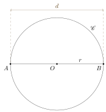

#+STARTUP: showall

#+TITLE: Eclats de vers : Matemat : Périmètre du cercle
#+AUTHOR: chimay
#+EMAIL: or du val chez gé courriel commercial
#+LANGUAGE: fr
#+LINK_HOME: file:../index.html
#+LINK_UP: file:index.html
#+HTML_HEAD: <link rel="stylesheet" type="text/css" href="../style/defaut.css" />

#+OPTIONS: H:6
#+OPTIONS: toc:nil

#+TAGS: noexport(n)

[[file:index.org][Index mathématique]]

#+INCLUDE: "../include/navigan-1.org"

#+TOC: headlines 1

#+INCLUDE: "../include/latex/latex.org"

* Périmètre du cercle
:properties:
:custom_id: heading:perimetre_du_cercle
:end:

#+attr_html: :width 40%
#+attr_latex: :width 0.7\linewidth

Nous avons tenu compte de la symétrie dans la notation des angles.

$$ \alpha = \frac{2 \ \pi}{n} $$

$$ \alpha = 2 \ \mu $$

$$ \mu = \frac{\alpha}{2} = \frac{2 \ \pi}{2 \ n} $$

$$ \mu = \frac{\pi}{n} $$

$$ p = \lim_{n \to \infty} 2 \ n \ r \ \sin\mu $$

$$ p = r \ \lim_{n \to \infty} 2 \ n \sin(\pi/n) $$

Quand $r = 1$ :

$$ \lim_{n \to \infty} 2 \ n \sin(\pi/n) = 2 \ \pi $$

$$ p = r \ \lim_{n \to \infty} n \sin(\pi/n) = 2 \ \pi \ r $$

* Convergence vers le nombre $\pi$

$$ \lim_{n \to \infty} 2 \ n \sin(\pi/n) = 2 \ \pi $$

$$ \lim_{n \to \infty} n \sin(\pi/n) = \pi $$

Considérons le cas d’un hexagone. On a $n = 6$, un angle :

$$ \alpha = \frac{\pi}{n} = \frac{\pi}{6} = 30^\circ $$

On a l’approximation de $\pi$ :

$$ \pi \approx 6 \sin 30^\circ = 6 \cdot \unsur{2} = 3 $$

* Diamètre

Le schéma ci-dessous représenté un cercle $\mathscr{C}$ de centre $O$,
de rayon $r$ et de diamètre $d$ :

#+attr_html: :width 35%
#+attr_latex: :width 0.7\linewidth

Le nombre pi, noté $\pi$, se définit comme étant le rapport constant
entre le périmètre du cercle et son diamètre. Si $p$ est le périmètre
de $\mathscr{C}$, on a donc :

$$ \pi = \frac{p}{d} $$

ou encore :

$$ p = \pi \ d $$

Comme le diamètre vaut deux fois le rayon $r$ :

$$ d = 2 \ r $$

on en déduit la forme alternative :

$$ p = 2 \ \pi \ r $$

* Amplitude d’un angle

TODO : adapter

L’amplitude d’un angle, exprimée en radians, peut se définir comme
le rapport entre :

- la longueur d’un arc de cercle
  + dont le centre est situé au sommet de l’angle
  + qui est délimité par les côtés de l’angle
- le rayon de ce même arc de cercle

#+attr_html: :width 30%
#+attr_latex: :width 0.7\linewidth

Dans le schéma ci-dessus, le rayon de l’arc de cercle
$\arcdecercle{DE}$ vaut :

$$ \mathscr{R} = \abs{AD} $$

et sa longueur vaut :

$$ \mathscr{L} = \abs{\arcdecercle{AB}} $$

l’amplitude $\alpha$ de l’angle $\angleflex{BAC}$ vaut :

$$ \alpha = \frac{\mathscr{L}}{\mathscr{R}} $$

* Limite

$$ \lim_{n \to \infty} \frac{n}{\pi} \ \sin(\pi/n) = 1 $$

$$ \lim_{n \to \infty} \frac{\sin(\pi/n)}{\pi/n}  = 1 $$
