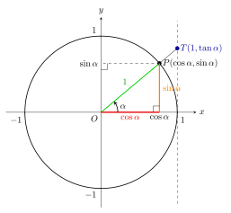

#+STARTUP: showall

#+TITLE: Eclats de vers : Matemat : Trigonometrie
#+AUTHOR: chimay
#+EMAIL: or du val chez gé courriel commercial
#+LANGUAGE: fr
#+LINK_HOME: file:../index.html
#+LINK_UP: file:index.html
#+HTML_HEAD: <link rel="stylesheet" type="text/css" href="../style/defaut.css" />

#+OPTIONS: H:6
#+OPTIONS: toc:nil

#+TAGS: noexport(n)

[[file:index.org][Index mathématique]]

#+INCLUDE: "../include/navigan-1.org"

#+TOC: headlines 1

#+INCLUDE: "../include/latex/latex.org"

* Triangle rectangle

#+TOC: headlines 1 local

** Indépendance

Considérons deux triangles rectangles $ABC$ et $XYZ$ qui
possèdent un angle $\alpha$ de même amplitude, en plus de
leur angle droit. Nous avons vu dans la section qui traite de
[[file:triangles-isometriques.org::#heading:angle_de_meme_amplitude][triangles
possédant un angle commun]]
 que nous pouvons construire un triangle
$ADE$ isométrique à $XYZ$, tel que les deux angles $\alpha$ soient
placés au même endroit :

#+attr_html: :width 35%
#+attr_latex: :width 0.7\linewidth

On définit :

$$ a = \abs{AB}
\qquad \qquad \qquad
b = \abs{BC}
\qquad \qquad \qquad
c = \abs{CA} $$

$$ x = \abs{AD}
\qquad \qquad \qquad
y = \abs{DE}
\qquad \qquad \qquad
z = \abs{EA} $$

Deux triangles rectangles qui possèdent un angle aigu de même amplitude
sont des triangles semblables. On a donc :

$$ \varphi = \frac{x}{a} = \frac{y}{b} = \frac{z}{c} $$

pour un certain réel $\varphi$ positif. On peut réécrire ces relations
sous la forme :

$$ x = \varphi \ a $$

$$ y = \varphi \ b $$

$$ z = \varphi \ c $$

Dans le triangle $ABC$, le rapport des cathètes nous donne :

$$ \frac{b}{a} $$

Dans le triangle $ADE$, le rapport des cathètes nous donne :

$$ \frac{y}{x} = \frac{\varphi \ b}{\varphi \ a} = \frac{b}{a} $$

On voit que ce rapport est indépendant du triangle choisi. Un raisonnement
analogue nous montre la même indépendance pour le rapport entre la
première cathète et l’hypothénuse :

$$ \frac{x}{z} = \frac{\varphi \ a}{\varphi \ c} = \frac{a}{c} $$

ainsi que pour le rapport entre la seconde cathète et l’hypothénuse :

$$ \frac{y}{z} = \frac{\varphi \ b}{\varphi \ c} = \frac{b}{c} $$

Lorsque l’angle $\alpha$ est fixé, les rapports de longueurs des
côtés d’un triangle rectangle sont indépendants du triangle choisi.
Ces rapports ne peuvent donc dépendre que de l’angle $\alpha$, ce
qui nous incite à les définir comme des fonctions de cet angle.

** Définitions

Soit le triangle rectangle :

#+attr_html: :width 23%
#+attr_latex: :width 0.7\linewidth

On définit la fonction trigonométrique du sinus, notée $\sin$, comme
le rapport entre le côté opposé à l’angle avec l’hypothénuse :

$$ \sin(\alpha) = \frac{b}{c} $$

On définit la fonction trigonométrique du cosinus, notée $\cos$, comme
le rapport entre le côté adjacent à l’angle avec l’hypothénuse :

$$ \cos(\alpha) = \frac{a}{c} $$

On définit la fonction trigonométrique de tangente, notée $\tan$, comme
le rapport entre le côté opposé et le côté adjacent :

$$ \tan(\alpha) = \frac{b}{a} $$

On a aussi les rapports inversés :

- cosécante :

$$ \csc(\alpha) = \frac{c}{b} $$

- sécante :

$$ \sec(\alpha) = \frac{c}{a} $$

- cotangente :

$$ \cot(\alpha) = \frac{a}{b} $$

** Notations

On note :

$$ \sin \alpha = \sin(\alpha) $$

$$ \cos \alpha = \cos(\alpha) $$

$$ \tan \alpha = \tan(\alpha) $$

et :

$$ \csc \alpha = \csc(\alpha) $$

$$ \sec \alpha = \sec(\alpha) $$

$$ \cot \alpha = \cot(\alpha) $$

*** Carrés

L’usage veut également que :

$$ \sin^2 \alpha = (\sin \alpha)^2 $$

$$ \cos^2 \alpha = (\cos \alpha)^2 $$

$$ \tan^2 \alpha = (\tan \alpha)^2 $$

et ainsi de suite. J’évite autant que possible cette notation
dans cet ouvrage, car elle n’est pas cohérente avec la notation
générale des fonctions qui veut que :

$$ f^2(x) = (f \circ f)(x) \ne [f(x)]^2 = f(x) \cdot f(x) $$

** Corollaires

En multipliant la définition du cosinus par $c$, on obtient :

$$ a = c \ \cos \alpha $$

En multipliant la définition du sinus par $c$, on obtient :

$$ b = c \ \sin \alpha $$

** Inverses multiplicatifs

On remarque que la cosécante est l’inverse du sinus :

$$ \csc\alpha = \frac{c}{b} = \frac{1}{b/c} = \unsur{\sin\alpha} $$

La sécante est l’inverse du cosinus :

$$ \sec\alpha = \frac{c}{a} = \frac{1}{a/c} = \unsur{\cos\alpha} $$

La cotangente est l’inverse de la tangente :

$$ \cot\alpha = \frac{a}{b} = \frac{1}{b/a} = \unsur{\tan\alpha} $$

** Angle complémentaire

Comme le triangle est rectangle, on a :

$$ \alpha + \beta = \frac{\pi}{2} $$

ou :

$$ \beta = \frac{\pi}{2} - \alpha $$

Le rapport entre le côté adjacent à $\beta$ et l’hypothénuse nous
donne :

$$ \cos \beta = \frac{b}{c} = \sin \alpha $$

c’est-à-dire :

$$ \cos\left(\frac{\pi}{2} - \alpha\right) = \sin \alpha $$

Le rapport entre le côté opposé à $\beta$ et l’hypothénuse nous
donne :

$$ \sin \beta = \frac{a}{c} = \cos \alpha $$

c’est-à-dire :

$$ \sin\left(\frac{\pi}{2} - \alpha\right) = \cos \alpha $$

Le rapport entre le côté opposé et le côté adjacent à $\beta$
nous donne :

$$ \tan \beta = \frac{a}{b} = \unsur{b/a} = \unsur{\tan \alpha} $$

c’est-à-dire :

$$ \tan\left(\frac{\pi}{2} - \alpha\right) = \unsur{\tan \alpha} $$

* Cercle trigonométrique

#+TOC: headlines 1 local

** Premier quadrant

Le cercle trigonométrique permet de généraliser la définition des
fonctions trigonometriques au-delà de l’intervalle $[0,\pi/2]$ :

#+attr_html: :width 42%
#+attr_latex: :width 0.7\linewidth

Ce cercle est un cercle unitaire, c’est-à-dire de rayon $1$, et permet
de générer un triangle rectangle dont l’hypothénuse vaut $1$ pour
chaque angle $\alpha$. La figure ci-dessus en illustre un exemple. Les
deux autres côtés sont alors de longueurs :

$$ a = 1 \cdot \cos \alpha = \cos \alpha $$

$$ b = 1 \cdot \sin \alpha = \sin \alpha $$

Ces longueurs correspondent aussi aux coordonnées du point $P$ qui
valent :

$$ (\cos \alpha, \sin \alpha) $$

dans le système d’axes $(O,x,y)$. Ces coordonnées peuvent varier
entre $-1$ et $1$, tout comme les valeurs des fonctions $\cos$ et $\sin$.

On en déduit les valeurs des fonctions trigonométriques $\cos$ et
$\sin$ pour n’importe quel angle entre $0$ et $2\pi$.

** Deuxième quadrant

Le schéma ci-dessous illustre le cas du deuxième quadrant,
c’est-à-dire de l’ntervalle $[\pi/2,\pi]$.

#+attr_html: :width 37%
#+attr_latex: :width 0.7\linewidth

On en déduit que :

$$ \cos(\alpha+\pi/2) = - \sin(\alpha) $$

$$ \sin(\alpha+\pi/2) = \cos(\alpha) $$

Pour la tangente, on a :

$$ \tan(\alpha + \pi/2)
= \frac{\sin(\alpha + \pi/2)}{\cos(\alpha + \pi/2)}
= \frac{\cos\alpha}{-\sin\alpha}
= \frac{-1}{\sin\alpha / \cos\alpha}
=  \frac{-1}{\tan\alpha} $$

** Troisième quadrant

Le schéma ci-dessous illustre le cas du troisième quadrant,
c’est-à-dire de l’ntervalle $[\pi,3\pi/2]$.

#+attr_html: :width 37%
#+attr_latex: :width 0.7\linewidth

On en déduit que :

$$ \cos(\alpha+\pi) = - \cos(\alpha) $$

$$ \sin(\alpha+\pi) = - \sin(\alpha) $$

Pour la tangente, on a :

$$ \tan(\alpha + \pi)
= \frac{\sin(\alpha + \pi)}{\cos(\alpha + \pi)}
= \frac{-\sin\alpha}{-\cos\alpha}
= \frac{\sin\alpha}{\cos\alpha}
=  \tan\alpha $$

** Quatrième quadrant

Le schéma ci-dessous illustre le cas du quatrième quadrant,
c’est-à-dire de l’ntervalle $[3\pi/2,2\pi]$.

#+attr_html: :width 37%
#+attr_latex: :width 0.7\linewidth

On en déduit que :

$$ \cos(\alpha+3\pi/2) = \sin(\alpha) $$

$$ \sin(\alpha+3\pi/2) = - \cos(\alpha) $$

Pour la tangente, on a :

$$ \tan(\alpha + 3\pi/2)
= \frac{\sin(\alpha + 3\pi/2)}{\cos(\alpha + 3\pi/2)}
= \frac{-\cos\alpha}{\sin\alpha}
= \frac{-1}{\sin\alpha / \cos\alpha}
= \frac{-1}{\tan\alpha} $$

** Angle supplémentaire

#+attr_html: :width 40%
#+attr_latex: :width 0.7\linewidth

Le schéma ci-dessus nous montre que :

$$ \cos(\pi - \alpha) = - \cos \alpha $$

$$ \sin(\pi - \alpha) = \sin \alpha $$

Pour la tangente, on a :

$$ \tan(\pi - \alpha)
= \frac{\sin(\pi - \alpha)}{\cos(\pi - \alpha)}
= \frac{\sin\alpha}{-\cos\alpha}
= - \tan\alpha $$

** Angles négatifs

Le schéma ci-dessous illustre le cas d’angles négatifs.

#+attr_html: :width 37%
#+attr_latex: :width 0.7\linewidth

On a clairement :

$$ \cos(-\alpha) = \cos(\alpha) $$

$$ \sin(-\alpha) = - \sin(\alpha) $$

Pour la tangente, on a :

$$ \tan(-\alpha)
= \frac{\sin(-\alpha)}{\cos(-\alpha)}
= \frac{-\sin\alpha}{\cos\alpha}
= - \tan\alpha $$

** Généralisation à n’importe quel angle réel

On considère qu’ajouter un nombre entier de tours complets (multiple
entier de $2\pi$) ne change rien aux fonctions trigonométriques. On a
donc :

$$ \cos(\alpha+2 \ \pi \ k) = \cos \alpha $$

$$ \sin(\alpha+2 \ \pi \ k) = \sin \alpha $$

pour tout $k \in \setZ$. Ce constat permet de couvrir l’ensemble des
angles à amplitude réelle.

* Relations fondamentales

#+TOC: headlines 1 local

** Préambule

Soit le triangle rectangle :

#+attr_html: :width 25%
#+attr_latex: :width 0.7\linewidth

** Sinus et cosinus

Le théorème de Pythagore dans notre triangle rectangle nous donne :

$$ a^2 + b^2 = c^2 $$

Mais comme :

$$ a = c \ \cos \alpha $$

$$ b = c \ \sin \alpha $$

la première relation devient :

$$ c^2 \ (\cos \alpha)^2 + c^2 \ (\sin \alpha)^2 = c^2 $$

On peut mettre $c^2$ en évidence :

$$ c^2 \ \left[(\cos \alpha)^2 + (\sin \alpha)^2\right] = c^2 $$

puis diviser par $c^2$ les deux membres, ce qui nous donne la relation
fondamentale entre sinus et cosinus :

$$ (\cos \alpha)^2 + (\sin \alpha)^2 = 1 $$

** Tangente

On a :

$$ \tan \alpha
= \frac{b}{a}
= \frac{b}{c} \cdot \frac{c}{a}
= \frac{b/c}{a/c} $$

Par définition des sinus et cosinus, on a donc :

$$ \tan \alpha = \frac{\sin \alpha}{\cos \alpha} $$

** Tangente et cosinus

Soit un angle $\alpha$ et :

$$ s = \sin\alpha $$

$$ c = \cos\alpha $$

$$ t = \tan\alpha $$

Les relations fondamentales nous donnent :

$$ s^2 + c^2 = 1 $$

et :

$$ t = \frac{s}{c} $$

ou encore :

$$ t^2 = \frac{s^2}{c^2} $$

Divisons la relation :

$$ s^2 + c^2 = 1 $$

par $c^2$. Il vient :

$$ \frac{s^2}{c^2} + 1 = \unsur{c^2} $$

c’est-à-dire :

$$ t^2 + 1 = \unsur{c^2} $$

Autrement dit :

$$ (\tan\alpha)^2 + 1 = \unsur{(\cos\alpha)^2} $$

** Cotangente

On a :

$$ \cot \alpha
= \frac{a}{b}
= \frac{a}{c} \cdot \frac{c}{b}
= \frac{a/c}{b/c} $$

Par définition des sinus et cosinus, on a donc :

$$ \cot \alpha = \frac{\cos \alpha}{\sin \alpha} $$

** Cotangente et sinus

Soit un angle $\alpha$ et :

$$ s = \sin\alpha $$

$$ c = \cos\alpha $$

$$ u = \cot\alpha $$

Les relations fondamentales nous donnent :

$$ s^2 + c^2 = 1 $$

et :

$$ u = \frac{c}{s} $$

ou encore :

$$ u^2 = \frac{c^2}{s^2} $$

Divisons la relation fondamentale :

$$ s^2 + c^2 = 1 $$

par $s^2$. Il vient :

$$ 1 + \frac{c^2}{s^2} = \unsur{s^2} $$

c’est-à-dire :

$$ 1 + u^2 = \unsur{s^2} $$

Autrement dit :

$$ 1 + (\cot\alpha)^2 = \unsur{(\sin\alpha)^2} $$

* Sinus et cosinus en fonction de la tangente

#+TOC: headlines 1 local

** Préambule

Soit un angle $\alpha$. Posons :

$$ s = \sin \alpha $$

$$ c = \cos \alpha $$

$$ t = \tan \alpha $$

Nous allons utiliser les relations fondamentales :

$$ t = s / c $$

$$ s^2 + c^2 = 1 $$

pour obtenir une expression du sinus et du cosinus comme fonction de
la tangente uniquement. En prenant le carré de la première équation
ci-cessus, on a :

$$ t^2 = s^2 / c^2 $$

Remarquons aussi que la relation fondamentale entre sinus et coinus peur
se réécrire, au choix, comme :

$$ s^2 = 1 - c^2 $$

ou comme :

$$ c^2 = 1 - s^2 $$

** Sinus en fonction de la tangente

On a :

$$ t^2 = \frac{s^2}{c^2} = \frac{s^2}{1 - s^2} $$

Multiplions par $1 - s^2$ :

$$ (1 - s^2) \ t^2 = s^2 $$

Distribuons :

$$ t^2 - s^2 \ t^2 = s^2 $$

et passons tous les termes en $s^2$ du même côté :

$$ t^2 = s^2 + s^2 \ t^2 $$

Mettons $s^2$ en évidence :

$$ t^2 = (1 + t^2) \ s^2 $$

En isolant $s^2$, on obtient :

$$ s^2 = \frac{t^2}{1 + t^2} $$

c’est-à-dire :

$$ (\sin \alpha)^2 = \frac{(\tan \alpha)^2}{1 + (\tan \alpha)^2} $$

On a donc soit :

$$ \sin \alpha = \sqrt{\frac{(\tan \alpha)^2}{1 + (\tan \alpha)^2}} $$

ou :

$$ \sin \alpha = - \sqrt{\frac{(\tan \alpha)^2}{1 + (\tan \alpha)^2}} $$

ce que l’on note sous la forme :

$$ \sin \alpha = \pm \sqrt{\frac{(\tan \alpha)^2}{1 + (\tan \alpha)^2}} $$

** Cosinus en fonction de la tangente

On a :

$$ t^2 = \frac{s^2}{c^2} = \frac{1 - c^2}{c^2} $$

Multiplions par $c^2$ :

$$ c^2 \ t^2 = 1 - c^2 $$

et passons tous les termes en $c^2$ du même côté :

$$ c^2 + c^2 \ t^2 = 1 $$

Mettons $c^2$ en évidence :

$$ (1 + t^2) \ c^2 = 1 $$

En isolant $c^2$, on obtient :

$$ c^2 = \frac{1}{1 + t^2} $$

c’est-à-dire :

$$ (\cos \alpha)^2 = \frac{1}{1 + (\tan \alpha)^2} $$

On a donc soit :

$$ \cos \alpha = \unsur{\sqrt{1 + (\tan \alpha)^2}} $$

ou :

$$ \cos \alpha = \frac{-1}{\sqrt{1 + (\tan \alpha)^2}} $$

ce que l’on note sous la forme :

$$ \cos \alpha = \frac{\pm 1}{\sqrt{1 + (\tan \alpha)^2}} $$

* Loi des sinus
:properties:
:custom_id: heading:loi_des_sinus
:end:

#+TOC: headlines 1 local

** Raisonnement

Soit un triangle quelconque. On peut toujours le décomposer en deux
triangles rectangles en traçant une hauteur $h$, comme suit :

#+attr_html: :width 30%
#+attr_latex: :width 0.7\linewidth

On définit :

$$ a = \abs{BC}
\qquad \qquad \qquad
b = \abs{CA}
\qquad \qquad \qquad
c = \abs{AB} $$

Dans le triangle rectangle de gauche, nous avons :

$$ h = b \ \sin \alpha $$

Dans le triangle rectangle de droite, nous avons :

$$ h = a \ \sin \beta $$

On en déduit que :

$$ a \ \sin \beta = b \ \sin \alpha $$

Divisons par $\sin\alpha \ \sin\beta$ :

$$ \frac{a}{\sin \alpha} = \frac{b}{\sin \beta} $$

On peut aussi tracer la hauteur perpendiculaire au côté $b$ et suivre un
raisonnement similaire, qui nous donne :

$$ a \ \sin \gamma = c \ \sin \alpha $$

c’est-à-dire :

$$ \frac{a}{\sin \alpha} = \frac{c}{\sin \gamma} $$

On a donc finalement la loi des sinus qui englobe les trois côtés :

$$ \frac{a}{\sin \alpha} = \frac{b}{\sin \beta} = \frac{c}{\sin \gamma} $$

Dans un triangle, le rapport entre la longueur d’un côté et le sinus de
l’angle opposé ne dépend pas du côté choisi.

** Corollaire
:properties:
:custom_id: heading:loi_des_sinus_corollaire
:end:

Multiplions la relation :

$$ \frac{a}{\sin \alpha} = \frac{b}{\sin \beta} $$

par $\sin \alpha$ et divisons la par $b$. Il vient :

$$ \frac{a}{b} = \frac{\sin \alpha}{\sin \beta} $$

En utilisant un raisonnement similaire avec les autres relations de la
loi des sinus, on obtient :

$$ \frac{a}{c} = \frac{\sin \alpha}{\sin \gamma} $$

et :

$$ \frac{b}{c} = \frac{\sin \beta}{\sin \gamma} $$

* Loi des cosinus, ou théorème d’Al Kashi
:properties:
:custom_id: heading:loi_des_cosinus
:end:

#+TOC: headlines 1 local

** Triangle acutangle

Soit un triangle acutangle quelconque. On peut toujours le décomposer
en deux triangles rectangles comme suit :

#+attr_html: :width 40%
#+attr_latex: :width 0.7\linewidth

On définit :

$$ a = \abs{BC}
\qquad \qquad \qquad
b = \abs{CA}
\qquad \qquad \qquad
c = \abs{AB} $$

$$ u = \abs{AD}
\qquad \qquad \qquad
v = \abs{DB} $$

Dans le triangle rectangle $ADC$, nous avons :

$$ u = b \ \cos \alpha $$

$$ h = b \ \sin \alpha $$

Appliquons à présent le théorème de Pythagore au triangle rectangle
$DBC$ :

$$ a^2 = h^2 + v^2 $$

Comme $ c = u + v $, on a :

$$ v = c - u $$

et :

$$ a^2 = h^2 + (c - u)^2 $$

En tenant compte des relations trigonométriques, cette équation
devient :

$$ a^2 = b^2 \ (\sin \alpha)^2 + (c - b \ \cos \alpha)^2 $$

Appliquons la formule de distribution du carré parfait :

$$ a^2 = b^2 \ (\sin \alpha)^2 + c^2 - 2 \ b \ c \ \cos \alpha + b^2 \ (\cos \alpha)^2 $$

et mettons $b^2$ en évidence :

$$ a^2 = b^2 \left[(\sin \alpha)^2 + (\cos \alpha)^2 \right] + c^2 - 2 \ b \ c \ \cos \alpha $$

Par la relation fondamentale du sinus et du cosinus, la somme entre
crochets vaut toujours 1, et on a finalement :

$$ a^2 = b^2 + c^2 - 2 \ b \ c \ \cos \alpha $$

Un raisonnement similaire nous donne un résultat analogue pour les
autres côtés :

$$ b^2 = a^2 + c^2 - 2 \ a \ c \ \cos \beta $$

$$ c^2 = a^2 + b^2 - 2 \ a \ b \ \cos \gamma $$

Dans un triangle, le carré d’un côté est égal à la somme des carrés
des deux autres côtés, à laquelle on enlève le double du produit
des deux autres côtés multiplié par le cosinus de l’angle opposé.

*** Cas particulier

Dans le cas particulier où $\gamma$ est un angle droit, le cosinus
s’annule et on retrouve le théorème de Pythagore :

$$ c^2 = a^2 + b^2 $$

La loi des cosinus est donc une généralisation du théorème de
Pythagore à un triangle quelconque.

** Triangle obtusangle

Soit un triangle acutangle $ABC$ quelconque et sa hauteur $h$, partant
du sommet $A$ et nécessitant une prolongation du côté opposé :

#+attr_html: :width 42%
#+attr_latex: :width 0.7\linewidth

Dans le triangle rectangle $BDC$, nous avons :

$$ u = a \ \cos \theta $$

$$ h = a \ \sin \theta $$

Appliquons à présent le théorème de Pythagore au triangle rectangle
$ADC$ :

$$ b^2 = h^2 + (c + u)^2 $$

En tenant compte des relations trigonométriques, cette équation
devient :

$$ b^2 = a^2 \ (\sin \theta)^2 + (c + a \ \cos \theta)^2 $$

Appliquons la formule de distribution du carré parfait :

$$ b^2 = a^2 \ (\sin \theta)^2 + c^2 + 2 \ a \ c \ \cos \theta + a^2 \ (\cos \theta)^2 $$

et mettons $a^2$ en évidence :

$$ b^2 = a^2 \left[(\sin \theta)^2 + (\cos \theta)^2 \right] + c^2 + 2 \ a \ c \ \cos \theta $$

Par la relation fondamentale du sinus et du cosinus, la somme entre
crochets vaut toujours 1, et on a finalement :

$$ b^2 = a^2 + c^2 + 2 \ a \ c \ \cos \theta $$

Comme $\theta$ et $\beta$ forment ensemble un angle plat on a :

$$ \beta + \theta = \pi $$

c’est-à-dire :

$$ \theta = \pi - \beta $$

On en déduit que :

$$ \cos \theta = \cos(\pi - \beta) = - \cos \beta $$

En tenant compte de cette identité, l’expression de $b^2$ devient :

$$ b^2 = a^2 + c^2 - 2 \ a \ c \ \cos \beta $$

équation identique à celle obtenue pour la loi des cosinus dans un
triangle acutangle.

En ce qui concerne les deux autres côtés, on peut appliquer le même
raisonnement que dans un triangle acutangle, ce qui nous donne :

$$ a^2 = b^2 + c^2 - 2 \ b \ c \ \cos \alpha $$

$$ c^2 = a^2 + b^2 - 2 \ a \ b \ \cos \gamma $$

* Aire d’un triangle

TODO

* Fonctions cyclométriques

#+TOC: headlines 1 local

** Introduction

Les fonctions trigonométriques étant périodiques, elles ne sont
pas directement inversibles, il faut préalablement en restreindre le
domaine. On définit ensuite les fonctions cyclométriques comme étant
les réciproques de ces fonctions trigonométriques restreintes.

** Arc sinus

Soit un certain $y \in [-1,1]$ et la valeur $x \in \setR$ solution
du problème :

$$\sin(x) = y$$

Comme la fonction $\sin$ est périodique de période $2 \ \pi$, on a :

$$\sin(x + 2 \ k \ \pi) = \sin(x) = y$$

pour tout $k \in \setN$. L'ensemble des solutions inclut donc
l’ensemble :

$$ S = \{ x + 2 \ \pi \ k : k \in \setN \} $$

qui admet une infinité d’éléments. On ne peut donc pas déduire
une seule valeur de $x$ à partir d’une valeur de $y$. Par contre,
l’ensemble des solutions ne contient qu’une seule valeur de $x$
dans l’invervalle $[-\pi/2,\pi/2]$, et on peut définir la fonction
arc sinus, notée $\arcsin$, par :

$$ \arcsin(y) = x
\qquad \Leftrightarrow \qquad
\left\lbrace \begin{array}{l}
y = \sin(x) \\
x \in [-\pi/2,\pi/2]
\end{array}
\right. $$

On note abusivement :

$$ \sin^{-1} = \arcsin $$

On utilise aussi la notation sans parenthèse, comme pour les autres
fonctions trigonometriques :

$$ \arcsin y = \arcsin(y) $$

On a :

$$ \sin\arcsin y = \sin x = y $$

pour tout $y \in [-1,1]$.

** Arc cosinus

Soit un certain $y \in [-1,1]$ et la valeur $x \in \setR$ solution
du problème :

$$\cos(x) = y$$

Comme la fonction $\cos$ est périodique, on ne peut pas déduire
une seule valeur de $x$ à partir d’une valeur de $y$. Par contre,
l’ensemble des solutions ne contient qu’une seule valeur de $x$ dans
l’invervalle $[0,\pi]$, et on peut définir la fonction arc cosinus,
notée $\arccos$, par :

$$ \arccos(y) = x
\qquad \Leftrightarrow \qquad
\left\lbrace \begin{array}{l}
y = \cos(x) \\
x \in [0,\pi]
\end{array}
\right. $$

On note abusivement :

$$ \cos^{-1} = \arccos $$

On utilise aussi la notation sans parenthèse, comme pour les autres
fonctions trigonometriques :

$$ \arccos y = \arccos(y) $$

On a :

$$ \cos\arccos y = \cos x = y $$

pour tout $y \in [-1,1]$.

** Arc tangente

Soit un certain $y \in \setR$ et la valeur $x \in \setR$ solution du
problème :

$$\tan(x) = y$$

Comme la fonction $\tan$ est périodique, on ne peut pas déduire
une seule valeur de $x$ à partir d’une valeur de $y$. Par contre,
l’ensemble $S$ ne contient qu’une seule valeur de $x$ dans
l’invervalle $\intervalleouvert{-\pi/2}{\pi/2}$, et on peut définir
la fonction arc tangente, notée $\arctan$, par :

$$ \arctan(y) = x
\qquad \Leftrightarrow \qquad
\left\lbrace \begin{array}{l}
y = \tan(x) \\
x \in \intervalleouvert{-\pi/2}{\pi/2}
\end{array}
\right. $$

On note abusivement :

$$ \tan^{-1} = \arctan $$

On utilise aussi la notation sans parenthèse, comme pour les autres
fonctions trigonometriques :

$$ \arctan y = \arctan(y) $$

On a :

$$ \tan\arctan y = \tan x = y $$

pour tout $y \in \setR$.
